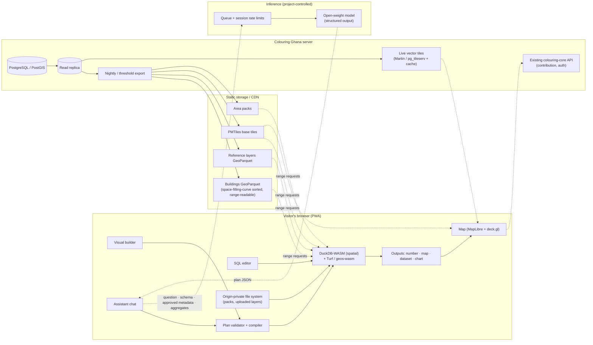

# Product Requirements Document
## Colouring Ghana Analytical Platform — Version 1

| Field | Value |
|---|---|
| Document | PRD-CG-ANALYTICS-V1 |
| Version | 0.4 (draft for review; map migration split into prerequisite epic E0, 2026-09-16) |
| Date | 2026-09-16 |
| Status | Draft — decisions recorded from the requirements dialogue of 15–16 Sept 2026 |
| Platform | Colouring Ghana (fork of colouring-cities/colouring-core), https://ngci.encs.concordia.ca/colouringghana/ |
| Owners | _to be assigned_ (product owner, technical lead, data curation lead, research lead) |
| Companion documents | `Design-Decisions-Plain-English.docx` (decision record for non-technical readers); `CLAUDE.md` (documentation requirements for the codebase) |

> **How to read this document.** Section 1–4 say what we are building and for whom. Section 5 lists the principles every requirement must obey. Sections 6–7 are the requirements (functional, then non-functional). Section 8 is the architecture those requirements imply. Sections 9–13 cover data, exclusions, open decisions, risks and delivery. The Appendices hold the decision log and worked examples. Every requirement has an identifier (`FR-x.y`, `NFR-x.y`) so that code, tests, documentation and commits can trace back to it.

---

## 1. Purpose

Colouring Ghana is a crowdsourced open spatial database of Ghana's building stock, built on the Colouring Cities Research Programme (CCRP) core platform. Today the platform lets people view, contribute and download building attribute data, but it offers no way to *ask questions of* that data — no spatial filtering, no aggregation, no analysis — without exporting it into desktop GIS software.

Version 1 of the Analytical Platform turns Colouring Ghana into a place where a visitor can ask a spatial question in plain words, by clicking, or in SQL; run it against the live building data, the platform's reference layers, and their own uploaded data; and get back a **number**, a **map**, and a **downloadable dataset** — with the analysis executing entirely in their own browser, working offline when needed, and with every answer stating what it is based on and how complete the underlying data is.

## 2. Background and motivation

- CCRP platforms are known for data visualisation and sharing. Analysis is the missing third capability; adding it makes the data usable by the people the programme exists to serve (planners, assemblies, researchers, residents) without a GIS specialist in the loop.
- Field consultation with planners in about five Metropolitan, Municipal and District Assemblies (MMDAs) identified **unreliable or absent internet connectivity** — even within Kumasi — as the primary obstacle to using any web platform. Offline capability is therefore a first-class requirement, not an enhancement.
- **Local data privacy** is a hard constraint. Planners and researchers hold datasets (proposed developments, hazard extents, ward boundaries) that must not be transmitted to a server they do not control.
- This is a research programme. Every decision, alternative, tool and implementation must be documented for reproducibility, traceability and accountability (see `CLAUDE.md`).
- The intent is **Ghana first, core later**: prove the capability on the Ghana instance, then contribute the portable parts to `colouring-core` for other CCRP partners.

## 3. Goals and non-goals

### 3.1 Goals (V1)

| ID | Goal | Measure of success |
|---|---|---|
| G1 | Any visitor can answer the five canonical questions (Section 4.2) without leaving the browser | All five pass acceptance tests via builder and via assistant |
| G2 | Every answer is a number, a map and a downloadable dataset, each carrying an "as of" timestamp and completeness counts | Verified on every output type |
| G3 | User-uploaded layers never leave the browser | Verified by network inspection in test; stated in privacy notice |
| G4 | Analysis, mapping and download work offline for a downloaded area pack | Acceptance test with network disabled |
| G5 | The AI assistant answers within the supported operation set and honestly declines outside it | Refusal test suite passes; zero fabricated statistical results |
| G6 | Map rendering is faster than the current Mapnik raster pipeline | Time-to-interactive and pan/zoom latency benchmarks |
| G7 | A training room of 30–50 planners can use the platform simultaneously | Load test passes NFR-2 targets |
| G8 | Every decision and implementation choice is documented | Documentation audit against `CLAUDE.md` |
| G9 | The five canonical questions can be completed from both the assistant bubble and Analyse mode without the user being moved between them, on desktop and on a phone | UI acceptance walkthrough per persona |

### 3.2 Non-goals (explicitly out of V1)

- Statistical modelling in the platform: regression, significance testing, spatial autocorrelation, hotspot analysis (deferred; see Section 10).
- Offline *contribution* (editing building attributes offline and syncing later). Accepted as a separate epic with its own PRD (Section 10.2).
- Persistent chat history for the assistant (V2 candidate).
- Server-side query execution for national-scale aggregates (deferred until the data footprint requires it).
- Contribution of this work to `colouring-core` (follows V1 success).
- Replacing or changing the existing crowdsourcing/contribution workflow.

## 4. Users and use cases

### 4.1 Audiences

All five audiences are **equally in scope** for V1. This was an explicit decision; the design consequence is that the platform must offer more than one way to express the same question (Section 5, Principle P3).

| Persona | Knows | Needs | Typical entry point |
|---|---|---|---|
| **GIS researcher** (may or may not know spatial SQL) | GIS concepts; often SQL; R/Python | Clean, reproducible, downloadable datasets with completeness counts; ability to inspect and edit the exact query | SQL editor, builder, assistant |
| **Planner** (MMDA or regional) | GIS concepts, not SQL | Site-scoped comparisons; maps for reports; works with poor connectivity | Builder, assistant, offline packs |
| **MMDA officer** (e.g. Kumasi Metropolitan Assembly) | Local geography, administrative units | Counts by administrative unit; which areas need attention; printable maps | Assistant, builder |
| **Student** | Varies | Exploratory questions across neighbourhoods; comparisons | Assistant |
| **Ordinary visitor / resident** | Their street and neighbourhood | What is recorded near them; what is missing; recent activity | Assistant |

### 4.2 Canonical questions (acceptance set)

These five questions were supplied by the product owner as real, practical examples. They are the **acceptance set**: V1 is complete when every one of them can be answered end-to-end (number, map, dataset) via the builder and via the assistant.

| # | Persona | Question (as a user would say it) | Plan decomposition (Section 6.1 operations) | Data touched |
|---|---|---|---|---|
| Q1 | MMDA officer | "How many residential buildings in my district are in the flood-prone zone and were recorded as being in poor condition, and which electoral areas have the most?" | `area(district)` → `filter(land use = residential, condition = poor)` → `spatial_relate(within flood zone)` → `aggregate(count by electoral area)` → `rank` | buildings; flood zones (reference); electoral areas (reference) |
| Q2 | Planner | "Within 500 m of the proposed new market site, what is the mix of building heights and construction materials, and how does it compare to the rest of the sub-metro?" | `area(drawn point)` → `buffer(500 m)` → `aggregate(cross-tab storeys × material)`; `compare` against `area(sub-metro)` with the same aggregate | buildings; sub-metro boundaries (reference); drawn geometry |
| Q3 | GIS researcher | "Which neighbourhoods have the highest concentration of buildings that are more than 30 years old, have poor structural condition, and are within 200 metres of a major road?" | `area(city)` → `filter(age > 30 y, condition = poor)` → `buffer(major roads, 200 m)` → `spatial_relate(within)` → `aggregate(count and share by neighbourhood)` → `rank` | buildings; major roads (reference); neighbourhoods (reference) |
| Q3′ | GIS researcher | "Is there a statistically meaningful relationship between building age and current structural condition, controlling for construction material, across Accra?" | **Not expressible.** Assistant declines the statistical operation and offers: `area(Accra)` → `filter` → `output(dataset: age, condition, material + completeness)` | buildings |
| Q4 | Student | "Which neighbourhoods have the highest share of buildings with no recorded connection to piped water or a paved road, and are those the same neighbourhoods with the oldest housing stock?" | `area` → `completeness / filter(is blank)` → `aggregate(share by neighbourhood)` → `rank`; second `aggregate(median age by neighbourhood)` → `rank`; `compare(rankings)` | buildings; neighbourhoods (reference) |
| Q5 | Resident | "How many buildings on my street have been added or edited in the last six months, and which attributes are still blank for most of them?" | `area(street)` → `recency(edited within 6 months)` → `aggregate(count)`; `completeness(per attribute)` | buildings; anonymised edit activity view; street geometry (reference) |

Q3′ is retained deliberately: it is the acceptance test for the assistant's **capability boundary** (FR-4.6).

## 5. Guiding principles

Every requirement in this document must be consistent with these principles. Where a future requirement conflicts with one, the conflict must be resolved in a recorded decision (ADR) before implementation.

| ID | Principle | Consequence |
|---|---|---|
| **P1** | **Privacy by construction.** A user's uploaded data never leaves their browser. | All analysis that touches uploaded data runs in the browser. The server never receives uploaded geometry or rows. |
| **P2** | **Browser-first execution.** One query engine, running in the visitor's browser, for all analysis. | The server's analytical role is to deliver timestamped data snapshots, tiles and reference layers; it does not execute user queries in V1. |
| **P3** | **One plan, three doors.** Every question — clicked, typed as SQL, or asked in words — becomes the same *query plan*, executed by the same engine. | Capabilities are built once. The builder is not a weaker version of the assistant; the assistant is not more powerful than the builder. |
| **P4** | **Every answer has a denominator.** No count, share or map is shown without the number of buildings it is drawn from and how many of them have the relevant attribute recorded. | Completeness is a property of every output, not a feature. |
| **P5** | **Every answer is "as of".** Results, maps and downloads carry the timestamp of the data snapshot they were computed from. | Reproducibility: plan + snapshot = analysis. |
| **P6** | **Honest capability boundary.** The assistant knows exactly what the engine can do and says plainly when a question falls outside it. | No improvised statistics; no silent approximations. |
| **P7** | **Offline is a first-class mode.** Analysis, mapping and download must work without connectivity once an area pack is loaded. | PWA; packs as plain files; sideloading. |
| **P8** | **Ghana first, core later.** Move fast on the Ghana instance; design the portable parts (plan format, snapshot endpoint, engine) so they can be contributed to `colouring-core`. | Keep Ghana-specific content (layers, definitions, prompts) separate from portable code. |
| **P9** | **Everything is documented.** Decisions, alternatives, tools, implementation and rationale. | See `CLAUDE.md`. |

## 6. Functional requirements

Priority: **M** = must have for V1; **S** = should have for V1; **C** = could have, first candidate for V1.x.

### 6.1 Query plan and execution engine

**FR-1.1 (M) Plan format.** The platform SHALL define a versioned, JSON-serialisable *query plan* format. A plan is an ordered chain of operations drawn from the vocabulary in FR-1.2, with a declared data scope and one or more declared outputs. The format SHALL have a published JSON Schema and a semantic-version number carried in every plan.

**FR-1.2 (M) Operation vocabulary.** V1 SHALL support exactly the following operations. Adding an operation requires an ADR.

| Operation | Description | Notes |
|---|---|---|
| `area` | Scope the query to a curated boundary (district, sub-metro, electoral area, neighbourhood, street), a drawn geometry (point, line, polygon), or the current map viewport | Every plan begins with `area`. Determines which snapshot partitions are fetched. |
| `filter` | Attribute predicates on buildings: equality, range, set membership, and the null-aware predicates `is recorded` / `is blank` | Null-awareness is mandatory (P4). |
| `buffer` | Distance buffer around a geometry: drawn, from a reference layer, or from an uploaded layer | Metres; geodesic-correct for Ghana's projection; documented in the plan. |
| `spatial_relate` | Relate buildings to a layer: `within`, `intersects`, `nearest` (with distance), `not within` | Layer may be reference (server-delivered) or uploaded (browser-only). |
| `aggregate` | Group by a boundary layer or by an attribute; measures: count, share, cross-tab (two attributes), min/max/median for numeric attributes | Every aggregate output includes denominator and recorded-count per group (P4). |
| `compare` | Run the same aggregate over two cohorts (e.g. buffer vs sub-metro) and present side by side | Cohorts are themselves sub-plans. |
| `rank` | Order aggregate results and take top/bottom N | |
| `recency` | Filter buildings by anonymised edit activity within a time window (added / edited / attribute-specific) | Reads only the anonymised activity view (FR-13). |
| `completeness` | For a set of buildings, count recorded vs blank per attribute (or per category) | Also implicitly attached to every aggregate. |
| `output` | Declare outputs: `number`, `map` (with a style spec), `dataset` (columns, format), `chart` (type, axes) | A plan may declare several outputs. |

**FR-1.3 (M) Execution engine.** Plans SHALL be executed in the browser by an embedded analytical database with spatial support (baseline decision: DuckDB-WASM with the `spatial` extension; see ADR-006). Geometry operations not available in that engine MAY be delegated to a browser geometry library (Turf.js or geos-wasm), and each such delegation SHALL be recorded in the plan compiler's documentation.

**FR-1.4 (M) Plan compiler.** A single compiler SHALL translate plans into engine SQL. The compiler is the *only* path from plan to execution; the builder, SQL editor and assistant SHALL NOT generate execution code independently.

**FR-1.5 (M) Plan validation.** Before execution, every plan SHALL be validated against the schema and against the live catalogue of available layers, attributes and operations. Invalid plans SHALL fail with a message a non-technical user can act on. Validation is the primary safety mechanism for assistant-generated plans (FR-4.5).

**FR-1.6 (M) Determinism.** Given the same plan and the same snapshot (same "as of" timestamp), execution SHALL produce identical results on any device. Acceptance test: golden results for the five canonical questions.

**FR-1.7 (S) Plan provenance.** Every executed plan SHALL be attachable to its outputs (number, map, dataset, chart) so that any result can be re-run or shared. Downloads SHALL embed the plan and snapshot timestamp (Section 6.5).

### 6.2 Visual query builder ("click actions")

**FR-2.1 (M)** A side-panel builder SHALL let a user compose a plan from the FR-1.2 operations by clicking, without typing code. Each operation appears as a step; steps can be added, reordered, edited and removed.

**FR-2.2 (M)** The builder SHALL expose the full FR-1.2 vocabulary. It SHALL NOT be a subset of what the assistant can produce (P3).

**FR-2.3 (M)** The builder SHALL work fully offline against a loaded pack (P7).

**FR-2.4 (M)** Any plan produced by the assistant SHALL open in the builder for inspection and editing before or after execution.

**FR-2.5 (S)** The builder SHALL offer templates for the five canonical questions with the specifics (district, distance, attribute) left for the user to fill.

**FR-2.6 (S)** The builder SHALL show, before execution, an estimate of the data it will fetch (area, number of partitions, approximate size) so users on poor connections can decide.

### 6.3 SQL editor

**FR-3.1 (S)** A SQL editor SHALL let a user write queries directly in the engine's SQL dialect against the locally loaded tables (buildings snapshot, reference layers, uploaded layers).

**FR-3.2 (S)** The editor SHALL expose the table catalogue (names, columns, types, geometry columns, snapshot timestamp) and the category definitions for attributes.

**FR-3.3 (S)** SQL results SHALL be routable to the same outputs as plans (number, map, dataset, chart) and SHALL carry the snapshot timestamp. Completeness counts are the user's responsibility in raw SQL, and the UI SHALL say so.

**FR-3.4 (C)** Where a SQL query is structurally equivalent to a plan, the editor MAY offer to convert it into a plan for sharing and offline re-use.

_Rationale: because execution is local, a SQL editor carries no server risk. It exists to serve researchers and as the universal escape hatch._

### 6.4 AI assistant

**FR-4.1 (M) Role.** The assistant translates a natural-language question into a validated plan, explains results in plain language, proposes follow-up questions, and produces chart and map-style specifications. It SHALL NOT execute anything itself and SHALL NOT generate SQL for execution.

**FR-4.2 (M) Model.** The assistant SHALL use an open-weight language model hosted on infrastructure controlled by the project (baseline: Concordia-hosted inference server). Model choice is an open decision (Section 11). The model SHALL support reliable structured (JSON-schema-constrained) output.

**FR-4.3 (M) Bring-your-own-endpoint.** A user MAY configure the assistant to use their own OpenAI-compatible endpoint and key (e.g. OpenRouter). The UI SHALL state clearly that in that case the question and approved metadata go to the provider of their choice. Project-funded keys SHALL never be exposed to public traffic.

**FR-4.4 (M) What the model may see.**

| Sent to the model | Condition |
|---|---|
| The user's question and the current session's prior questions/plans | Always (session lives in the browser; see FR-4.8) |
| The buildings schema, category and attribute definitions, list of curated layers and their fields | Always |
| Column names, types, row count and geometry type of an uploaded layer | **Only after explicit per-layer user approval** via a dialog that lists exactly what will be shared |
| Aggregate result values (counts, shares, cross-tabs, rankings) with geometry stripped | After execution, for explanation and charting |

| Never sent to the model |
|---|
| Rows or geometry of an uploaded layer |
| Building geometry or per-building rows |
| Contributor identities or raw edit-log entries |
| Any result that embeds uploaded geometry (e.g. a buffer polygon derived from an upload) |

**FR-4.5 (M) Plans only.** The assistant's output SHALL be a plan conforming to FR-1.1, validated by FR-1.5 before execution. The plan SHALL be shown to the user, who may run, edit (in the builder) or discard it.

**FR-4.6 (M) Capability boundary.** The assistant SHALL be grounded in the FR-1.2 vocabulary. When a question requires an unsupported operation (including but not limited to regression, significance testing, spatial autocorrelation, prediction), the assistant SHALL: (a) state plainly that the platform does not support that operation; (b) name what it *can* do that is closest; (c) offer a plan that produces the downloadable dataset a user would need to perform the analysis elsewhere, with completeness counts. Acceptance test: Q3′.

**FR-4.7 (M) Map and chart from the assistant.** "Draw it on the map" is expressed as an `output(map, style)` element of the plan, rendered locally; the model never renders or receives geometry.

**FR-4.8 (M) Anonymous and stateless.** The assistant SHALL be available to anonymous visitors. The server SHALL NOT store conversation history. The session (questions, plans, results) lives in the browser tab; the user SHALL be able to download the session as plans + results.

**FR-4.9 (M) Online only in V1.** When offline, the assistant entry point SHALL be disabled with a clear message, and saved or template plans remain runnable.

**FR-4.10 (S) Grounding corpus.** The assistant SHALL be grounded (retrieval or prompt-embedded) in: the CCRP data-category definitions as adapted for Ghana; Ghana administrative geography; the list of reference layers; and a semantic layer of named metrics with fixed definitions (e.g. "share of buildings in poor condition" = poor ÷ recorded, not poor ÷ total). All prompts and grounding documents SHALL be version-controlled.

**FR-4.12 (M) Response types.** The assistant's structured output has exactly two types: `plan` (FR-1.1) and `clarification` (FR-14.8). No free-text-only answers except the capability-boundary refusal (FR-4.6), which is itself a typed response with the offered dataset plan attached.

**FR-4.11 (S) Evaluation set.** A maintained evaluation set of questions with expected plans (or expected refusals) SHALL be run against every model or prompt change and the results recorded.

### 6.5 Outputs

**FR-5.1 (M) Number.** A headline figure with: value, denominator (buildings in scope), recorded count for the attributes used, snapshot timestamp, and the plan.

**FR-5.2 (M) Map.** Results rendered on the map from local data: highlighted buildings, choropleth by boundary, buffers and drawn geometries. Style is declared in the plan. Maps SHALL include a legend and the "as of" timestamp, and SHALL be exportable as an image with those elements.

**FR-5.3 (M) Dataset.** Download of the result rows as GeoParquet, GeoJSON and CSV (WKT geometry), with a sidecar or embedded metadata block containing: plan, snapshot timestamp, completeness per attribute, licence (ODbL), and citation text.

**FR-5.4 (S) Chart.** Bar, stacked bar and cross-tab charts generated from aggregate results, exportable as image.

**FR-5.5 (M) Completeness display.** Every output SHALL display completeness in a consistent, non-dismissable form, e.g. "Of 41,000 residential buildings in the flood zone, condition is recorded for 6,200; of those, 1,900 are recorded as poor."

### 6.6 Uploaded layers

**FR-6.1 (M) Formats.** Users MAY load GeoJSON, Shapefile (zipped), GeoPackage, CSV with coordinates, and GeoParquet from their device.

**FR-6.2 (M) Browser only.** Uploaded data SHALL be parsed, stored and queried entirely in the browser (engine tables and origin-private file system). No upload endpoint SHALL exist for analysis layers. Acceptance: automated network-capture test proves no request contains uploaded rows or geometry.

**FR-6.3 (M) Extent disclosure.** To fetch relevant building data, the browser sends either a bounding box or a chosen curated area. The user SHALL be told which, and MAY choose "fetch by area I select" to avoid revealing the upload's extent. The privacy notice SHALL state: "The geometry and contents of layers you load never leave your browser. If you let a query fetch data by extent, the rough bounding box of your layer is sent to the server."

**FR-6.4 (M) Metadata approval.** Before the assistant is told anything about an uploaded layer, the user SHALL approve a dialog listing exactly the metadata to be shared (FR-4.4).

**FR-6.5 (S) Persistence.** Uploaded layers MAY persist in the browser between sessions (opt-in), with a clear "remove" control and a list of what is stored.

### 6.7 Reference layers (curated)

**FR-7.1 (M)** The platform SHALL maintain a catalogue of curated reference layers, delivered from the server and included in packs. V1 minimum set:

| Layer | Status (Sept 2026) | Needed by |
|---|---|---|
| District (MMDA) boundaries | Loaded, awaiting production push | Q1, packs |
| Electoral areas | To source and load | Q1 |
| Sub-metro boundaries | To source and load | Q2 |
| Neighbourhoods | To source and load (definition to be agreed) | Q3, Q4 |
| Major roads | To source and load (classification to be agreed) | Q3 |
| Flood-prone zones | Layer exists in "Show layer options"; data to load | Q1 |
| Streets (named, for `area(street)`) | To source and load | Q5 |

**FR-7.2 (M)** Each reference layer SHALL have a documented provenance record: source, licence, version/date, processing steps, known limitations, and the person responsible (see `CLAUDE.md`, data provenance).

**FR-7.3 (S)** Reference layers SHALL be versioned and carry their own "as of" date; packs and snapshots SHALL record which version they contain.

### 6.8 Snapshot and data delivery

**FR-8.1 (M) Spatially addressable snapshot.** The server SHALL publish the buildings table as a GeoParquet dataset sorted along a space-filling curve, written in row groups with bounding-box statistics, so that the browser engine can read only the row groups intersecting a query area via HTTP range requests. Column pruning SHALL be supported so plans fetch only the attributes they use.

**FR-8.2 (M) Timestamp.** Each snapshot SHALL carry the database transaction time at which it was exported, exposed to the client and stamped on every output.

**FR-8.3 (M) Refresh.** Snapshots SHALL be regenerated on a schedule (baseline: nightly) and additionally when edits since the last export exceed a configurable threshold. Generation SHALL run from a read replica or a low-priority connection with a statement timeout so it cannot block contributors (NFR-2.5).

**FR-8.4 (M) Static delivery.** Snapshots, packs and tiles SHALL be served as static files supporting HTTP range requests and resumable downloads, and SHALL be cacheable by a CDN.

**FR-8.5 (M) Size guard.** A plan whose fetch exceeds a configurable size cap SHALL not run automatically; the user SHALL be told the estimated size and offered a narrower area or a pack download.

**FR-8.6 (S) Reference-layer delivery.** Reference layers SHALL be delivered the same way (GeoParquet, range-readable) and clipped into packs.

### 6.9 Map rendering

> **Delivery note (2026-09-16).** FR-9 is delivered as a **separate prerequisite epic** with its own tracking issue, branch (`feature/<issue>-maplibre-migration`), `/to-spec` and tickets — not inside the analytics epic. It merges to `master` first, behind a feature flag, and goes to production with Mapnik retained as fallback until FR-9.5 passes. The analytics integration branch is rebased onto it once merged. Rationale: the migration is valuable on its own (rendering speed), is the riskiest change to existing View/Edit users, and is the piece `colouring-core` will scrutinise most, so it needs its own release and its own reviewable PR. See ADR-018 and Section 13.


**FR-9.1 (M) Vector rendering.** The map SHALL move from Leaflet with Mapnik raster tiles to MapLibre GL with vector tiles, behind a feature flag that allows per-environment (and, during soak, per-user) switching between the two stacks. Mapnik SHALL be retired from the Ghana instance once parity (FR-9.5) is reached and the new stack has run in production for an agreed soak period.

**FR-9.2 (M) Base tiles.** Building base tiles SHALL be published as PMTiles (single-file vector tile archives generated from the nightly export), served statically with range requests and included in packs.

**FR-9.3 (S) Live tiles.** When online, a live vector-tile service (Martin or pg_tileserv over PostGIS, with a tile cache) MAY be layered over the PMTiles base so that recent edits appear promptly.

**FR-9.4 (M) Result rendering.** Query results (highlighted buildings, choropleths, buffers) SHALL be rendered from local engine data (deck.gl or MapLibre GeoJSON sources), never by a round-trip to the server.

**FR-9.5 (M) Parity.** The existing category colour schemes, legend behaviour, building selection, geolocation control, layer options and edit workflow SHALL be preserved in the new map stack. Migration is complete only when a documented parity checklist passes in production.

**FR-9.6 (M) Dependency gate.** Analytics tickets that depend on the new map — result view (FR-14.5), client-side result rendering (FR-9.4), building popup in result view (FR-14.6), draw tool (FR-14.10) and PMTiles in packs (FR-10.2) — SHALL NOT start until the migration epic has merged to `master`. All other analytics work (plan format, engine, builder logic, outputs, uploaded layers, snapshot exporter, reference layers, assistant, offline pack manager) proceeds in parallel.

### 6.10 Offline operation

**FR-10.1 (M) PWA.** The platform SHALL be installable as a Progressive Web App with a service worker caching the application shell.

**FR-10.2 (M) Area packs.** A user SHALL be able to download a pack for a curated area (V1: district). A pack contains: PMTiles for the area; GeoParquet buildings snapshot for the area (all attributes); reference layers clipped to the area; category/attribute definitions; manifest with snapshot timestamp, layer versions, pack format version and checksums.

**FR-10.3 (M) Pack storage.** Packs SHALL be stored in the browser's origin-private file system and listed in a "My packs" view showing area, "as of" date, size, and a remove control.

**FR-10.4 (M) Offline capabilities.** With a pack loaded and no connectivity: map browsing within the pack area, builder, SQL editor, all outputs and downloads, saved and template plans SHALL work. The assistant SHALL be unavailable (FR-4.9).

**FR-10.5 (M) Load pack from file.** The PWA SHALL accept a pack from a local file (USB, LAN share, sent by messaging app), verifying the manifest and checksums. This is the training-room and low-bandwidth distribution path.

**FR-10.6 (M) Freshness.** The UI SHALL always show the "as of" date of the active pack and, when online, whether a fresher pack exists.

**FR-10.7 (S) Delta updates.** Packs MAY be updated by downloading only changed row groups since the pack's timestamp.

**FR-10.8 (S) Pack mirror.** Documentation SHALL describe running a plain static file server on a laptop to distribute packs over a room's LAN, requiring no special software.

### 6.11 Saved and shared plans

**FR-11.1 (M)** A user SHALL be able to save a plan locally (browser storage and file export) and re-run it later, online or offline.

**FR-11.2 (S)** A plan SHALL be shareable as a URL or file; the recipient's platform reconstructs and runs it against their current snapshot, showing both "as of" dates if they differ.

**FR-11.3 (C)** Logged-in users MAY save plans to their account (V2 candidate alongside chat history).

### 6.12 Assistant access and abuse control

**FR-12.1 (M) Session tokens.** Rate limits for the assistant SHALL be per browser session (token minted on first load), not per IP, so that a training room behind one public IP is not locked out. IP-level limits SHALL be set only to catch abuse.

**FR-12.2 (M) Queue transparency.** When inference capacity is saturated, the UI SHALL show queue position or a "busy" state with an estimated wait, and SHALL point to the builder as the zero-wait alternative.

**FR-12.3 (S) Challenge.** A lightweight challenge (proof-of-work or similar) MAY be enabled under sustained abuse.

### 6.13 Edit-activity analytics (anonymised)

**FR-13.1 (M)** Q5-type questions SHALL be answered from an **anonymised activity view** derived from the edit log: per building, per attribute, per time period — counts of additions and edits, and last-edit timestamp. No contributor identifier, name, or per-user field SHALL exist in this view.

**FR-13.2 (M)** The snapshot export process SHALL be the only reader of the edit log for analytical purposes, and SHALL read only the anonymised view. This SHALL be enforced by database permissions on the export role and documented.

**FR-13.3 (M)** Attribute completeness per building (FR-1.2 `completeness`) SHALL be computed from the buildings snapshot, not from the edit log.

### 6.14 User interface

Decided in the UI dialogue of 16 Sept 2026 against the current Colouring Ghana screen (left sidebar with twelve category tiles and a category panel beneath; full-height map with search box top-left, mode/layer buttons top-right, legend bottom-right; View / Edit modes in the route, e.g. `/view/location/16833` where 16833 is the selected building).

**FR-14.1 (M) Analyse mode.** Analysis is a third sidebar mode alongside View and Edit. The category tile grid remains visible above the analysis panel so the map can be recoloured by category at any time. The panel has two tabs, **Build** and **SQL**, the plan card at the top and the results summary beneath. Route: `/analyse/<encoded plan or plan id>`; building IDs stay on view routes. The panel contains an "Ask instead" link that opens the assistant bubble (FR-14.2); there is no Ask tab.

**FR-14.2 (M) Assistant bubble.** The assistant lives in a floating bubble at the bottom-left of the map, below the search box, visible in all modes. Clicking it opens an anchored panel that grows upward over the map (target width ~360 px, height capped at ~60% of the map). Offline, the bubble is greyed with the message "needs a connection" and does not open. On mobile the bubble expands into a bottom sheet.

**FR-14.3 (M) Conversation stays in place.** The conversation, plan cards, Run, and the results summary (number, completeness, "as of", result cards) all remain in the bubble panel. Running a plan does not move the user. The only hand-off to the sidebar is the plan card's **Edit in builder** action, which opens Analyse mode with that plan loaded; the only hand-off back is "Ask instead".

**FR-14.4 (M) Plan card.** The plan card is rendered identically in the bubble and in the sidebar and is the shared object between them. It shows a one-line plain-English summary, the steps expanded beneath (collapsible), and the actions Run, Edit in builder, Save, Share. A plan made in the builder can be sent to the assistant for explanation of its result.

**FR-14.5 (M) Result view.** Running a plan puts the map into result view: all buildings neutral except matches (highlight) or the choropleth by boundary layer; the bottom-right legend switches to the result. Clicking any category tile restores category colouring without discarding the plan; a "Back to result" control re-enters result view. Only one styling is shown at a time; results never overlay category colours.

**FR-14.6 (M) Building popup in result view.** Clicking a building in result view opens a small map popup listing the attributes the running plan referenced (e.g. condition, land use, electoral area), showing "not recorded" for blanks, with an **Open building** link to the existing view route. The popup's contents are derived from the plan, not hand-designed per query.

**FR-14.7 (M) Result cards and modal.** Tables and charts are presented as result cards inline in the conversation or sidebar: name, small preview, "as of" stamp, completeness line, download formats. Clicking a card opens it full-size in a centred modal over the map with download and close; on mobile the modal is full-screen. There is no results drawer. The map is never a card (result view is the map output). The downloadable session (FR-4.8) is the ordered list of result cards and their plans.

**FR-14.8 (M) Location clarification.** No location context is sent to the assistant or server by default. When a question needs a place ("here", "my street", "this area"), the assistant returns a clarification, rendered as choice chips: **This view · My location · A district… · Draw an area · A street name…**. Choosing a chip is the consent that sends the corresponding information; "This view" sends the viewport bounding box; "A district…" and "A street name…" send the named area only. The assistant's response format therefore has two types — `plan` and `clarification` (kinds: area, distance, attribute value) — and the evaluation set (FR-4.11) includes cases where the correct answer is a clarification, not a guessed plan.

**FR-14.9 (M) My location.** Choosing "My location" uses the device geolocation feature (existing in the dev version). The fix is resolved **locally** against reference layers; the assistant never receives coordinates. The person is then always shown both resolutions and chooses: (a) the containing named area (street / neighbourhood / electoral area / district), which sends only the area name; or (b) a radius around the exact point, which sends a bounding box around the point to fetch the snapshot and is labelled "Uses your exact position to fetch nearby buildings". The UI shows the fix's accuracy and lets the person confirm the resolved area before the plan runs. Works offline in the builder because reference layers are in every pack.

**FR-14.10 (M) Layers, packs and drawing.** Reference layers and user uploads both live in "Show layer options"; the upload control carries the browser-only notice (FR-6.3). Packs and pack management live in the Menu; the offline/online state and the active pack's "as of" are shown in the header. Drawing a point, line or area (for `area(drawn)` and `buffer`) uses a draw tool in the map-corner button stack, invoked from a builder step or from the "Draw an area" chip.

**FR-14.11 (M) Geolocation audit — resolved 2026-09-16.** The existing control (`src/frontend/map/geolocation-control.tsx`) was audited before FR-14.9 was specified. Findings, recorded verbatim as the data-flow baseline:

- The fix never goes to the server. The control is purely client-side; position callbacks feed Leaflet objects held in refs. No `fetch`, `apiGet`, storage or URL writes in the file; nothing else in the frontend reads the current position.
- Accuracy: requests high accuracy (`enableHighAccuracy: true`), typically 3–10 m outdoors on a phone. Raw `coords.accuracy` becomes the radius of the accuracy circle; latitude/longitude are used at full precision for the marker; heading from the device compass, falling back to GPS heading. Held in memory only; watch cleared and marker removed on unmount.
- Indirect exposures: (a) recentre calls `map.setView(pos, 19)`, so the tile service receives zoom-19 tile requests around the user (≈75 m granularity — the same exposure as panning to one's own house); (b) a map click sends the clicked lat/lng to `/api/buildings/locate` (the click point, not the fix, though near-identical if the user taps their own marker); (c) console warnings log error descriptions only, never coordinates.

Consequences adopted:

- **FR-14.11.a** The named-area path of FR-14.9 SHALL resolve and confirm the area *without* recentring the map on the fix; only the radius path (which discloses a bounding box regardless) MAY centre the map.
- **FR-14.11.b** In result view, building clicks SHALL resolve against the local engine table (FR-14.6), not `/api/buildings/locate`.
- **FR-14.11.c** After the map migration (FR-9), tile-level location exposure moves from the tile server to whoever hosts the static PMTiles/CDN; the privacy notice SHALL state this. `RECENTER_ZOOM` remains the only lever on that exposure; lowering it to 17 is an open choice for the existing control, not a requirement of this PRD.
- **FR-14.11.d** This audit is the provenance record for the geolocation data flow; any change to the control that adds a network or storage write requires a new ADR.

## 7. Non-functional requirements

### 7.1 Performance

| ID | Requirement | Target (to validate by benchmark) |
|---|---|---|
| NFR-1.1 | Engine query on a district-sized snapshot (~21,000 buildings, full attributes) | Any canonical question completes in < 2 s on a mid-range laptop; < 5 s on a mid-range Android phone |
| NFR-1.2 | Snapshot fetch for a 500 m buffer, column-pruned | < 1 MB transferred |
| NFR-1.3 | District pack size (Oforikrom baseline) | Target < 50 MB; hard cap is an open decision (Section 11) |
| NFR-1.4 | Map time-to-interactive (online, cold cache) | Faster than current Mapnik baseline; measured before migration and after |
| NFR-1.5 | Pan/zoom tile latency (PMTiles, warm CDN) | < 200 ms per tile at p95 |

### 7.2 Concurrency and capacity

| ID | Requirement |
|---|---|
| NFR-2.1 | **Named load case:** 30–50 planners in one training room, one shared public IP, one shared internet connection, all active within the same five minutes. |
| NFR-2.2 | Assistant: 50 concurrent plan requests complete with worst-case latency < 30 s, with queue position visible; validated by load test before the first training session; hardware sized to meet this. |
| NFR-2.3 | Pack and snapshot delivery is static file serving; no per-request server computation. |
| NFR-2.4 | Query execution imposes zero server load (browser-side). |
| NFR-2.5 | Snapshot/tile generation never blocks contribution writes (read replica or low-priority connection with statement timeout). |
| NFR-2.6 | Live tile service, if enabled, sits behind a tile cache. |

### 7.3 Privacy and security

| ID | Requirement |
|---|---|
| NFR-3.1 | No endpoint accepts uploaded analytical layers. Verified by test (FR-6.2). |
| NFR-3.2 | The inference service logs no request bodies beyond what is needed for rate limiting and error diagnosis; retention documented; no training on user inputs. |
| NFR-3.3 | Privacy notice covers: what leaves the browser (question text, metadata with approval, bounding box or area, aggregates), what never does, what the assistant is, and the bring-your-own-endpoint caveat. |
| NFR-3.4 | Contributor identities never present in any analytical artefact (snapshot, pack, view, download). |
| NFR-3.5 | Export role has read access only to the buildings tables, reference layers and the anonymised activity view. |
| NFR-3.6 | Content Security Policy permits the engine's WebAssembly and worker requirements while blocking unnecessary origins. |

### 7.4 Low-bandwidth and device constraints

| ID | Requirement |
|---|---|
| NFR-4.1 | All large downloads resumable (range requests). |
| NFR-4.2 | The application shell works on Android Chrome and iOS Safari current-minus-two versions; memory budget for a district pack documented. |
| NFR-4.3 | Every feature that needs the network states so before attempting it. |

### 7.5 Reproducibility and documentation

| ID | Requirement |
|---|---|
| NFR-5.1 | Plan format, snapshot format, pack format and anonymised activity view are specified in versioned documents. |
| NFR-5.2 | Golden test results for the five canonical questions stored with the snapshot they were computed from. |
| NFR-5.3 | Every decision, alternative, tool and implementation is documented per `CLAUDE.md`; a documentation audit is part of the definition of done. |
| NFR-5.4 | Model, prompt and grounding-corpus versions are recorded and reproducible; evaluation results archived. |

### 7.6 Accessibility and language

| ID | Requirement |
|---|---|
| NFR-6.1 | Builder and outputs keyboard-navigable and screen-reader labelled (WCAG 2.1 AA as target). |
| NFR-6.2 | Plain-English microcopy; every technical term shown in the UI has a hover/tap definition drawn from the shared glossary. |

## 8. Architecture overview



**Portable to `colouring-core` (P8):** plan format and compiler; snapshot exporter and format; pack format and PWA offline layer; engine integration; map stack migration. **Ghana-specific:** reference layers, category definitions, grounding corpus, prompts, privacy notice text.

## 9. Data requirements

- **Buildings.** Existing `colouring-core` buildings table (~100 attributes across the CCRP categories as configured for Ghana). Pilot area: Oforikrom Municipal, 21,200 footprints (2023 recency). Planned expansion: Greater Kumasi and parts of Accra using the 2025 national footprint dataset (footprint counts to be recorded when loaded; expected to be in the hundreds of thousands for Greater Kumasi).
- **Reference layers.** Section 6.7. Sourcing, licensing and definitional questions (what is a "neighbourhood"; which road classes are "major") are a data-curation workstream on the critical path and must be recorded as ADRs.
- **Anonymised activity view.** Section 6.13; SQL definition versioned.
- **Licensing.** Downloads carry ODbL attribution; reference-layer licences recorded in provenance.

## 10. Out of scope and future work

### 10.1 Deferred capabilities (V2 candidates)

| Item | Why deferred | Preconditions |
|---|---|---|
| Statistical engine (regression, significance, spatial autocorrelation) | Needs a Python/R service and responsible interpretation; highest AI-safety risk | Design with research lead; separate ADR |
| Server-side plan execution for national aggregates | Not needed at V1 data footprint | Same plan format; add a PostGIS compiler target |
| Chat history and account-saved plans | Anonymous, stateless V1 | Accounts and retention policy |
| "MMDA box" local inference server for offline assistant | Hardware and support model | Pilot with one assembly |
| Contribution to `colouring-core` | Ghana first | V1 stable in production; core maintainers consulted |

### 10.2 Offline contribution (separate epic)

Accepted in principle by the product owner; **not part of this PRD**. Sketch for the future PRD: edits queue locally for logged-in users; a quiet persistent badge ("N edits waiting to sync") with a gentle reminder on each visit; on reconnect the queue replays against the live API; server detects attribute changes by others since the user's snapshot and flags conflicts for user resolution rather than overwriting. The hard part is conflict semantics against core's edit log and verification workflow.

## 11. Open decisions (to be resolved by ADR before the affected milestone)

| # | Decision | Options on the table | Needed by |
|---|---|---|---|
| OD-1 | Open-weight model and inference hardware | Model family/size with reliable structured output; single-GPU vs rented instance; vLLM or equivalent | M3 |
| OD-2 | Pack size hard cap and delta-update strategy | Cap per pack; row-group delta vs full replace | M4 |
| OD-3 | Neighbourhood and major-road definitions and sources | Ghana Statistical Service units; OSM; assembly-supplied | M0 |
| OD-4 | Extent disclosure default | Bounding box by default vs area-select by default (FR-6.3) | M2 |
| OD-5 | Live tiles in V1 or V1.x | Martin vs pg_tileserv vs PMTiles-only | M1 |
| OD-6 | Space-filling-curve and row-group sizing for the snapshot | Hilbert vs Z-order; row-group target size vs range-request overhead | M1 |
| OD-7 | Anonymised activity view granularity | Per-attribute per-month vs per-edit-event | M2 |
| OD-8 | Geometry library for operations beyond the engine's spatial extension | Turf.js vs geos-wasm; which operations | M2 |
| OD-9 | Session download format | Plans + results bundle format and naming | M2 |
| OD-10 | ~~Confirm whether the existing geolocation feature sends the device fix to the server~~ **Resolved 2026-09-16:** it does not; findings and consequences in FR-14.11 | — | Closed |

## 12. Risks

| Risk | Impact | Mitigation |
|---|---|---|
| Reference layers unavailable or unlicensed | Q1, Q3, Q4 cannot be answered | Start curation in M0; record fallbacks (e.g. OSM) |
| Model produces invalid or subtly wrong plans | Wrong answers to public officials | Validator; evaluation set; plan shown before run; builder for correction |
| Map migration regresses contribution workflow | Existing users harmed | Separate epic (E0) with its own release; feature flag; parity checklist in production; Mapnik kept until soak passes |
| Analytics branch drifts from the map branch while E0 is open | Painful rebase | Keep map-independent work strictly off map code; rebase analytics onto `master` promptly after E0 merges |
| Pack too large for real connections | Offline goal fails | Size cap; column pruning; delta updates; sideloading |
| Browser memory limits on phones | Engine crashes | Memory budget; area scoping; graceful degradation |
| Inference capacity insufficient for training sessions | Poor first impression | Load test; queue UI; builder fallback; pre-session warm-up |
| Completeness confuses users ("why two numbers?") | Misreading | Consistent microcopy; glossary; user testing with MMDA officers |
| Documentation debt | Research accountability fails | `CLAUDE.md` rules; audit in definition of done |

## 13. Delivery phases (sequence, not dates)

| Phase | Scope | Exit criteria |
|---|---|---|
| **E0 — Map migration (prerequisite epic, own branch)** | FR-9: MapLibre GL, PMTiles pipeline, optional live tiles, feature flag, parity checklist (FR-9.5); benchmarks of the Mapnik baseline recorded before, new stack after | Merged to `master` behind flag; parity passes in production; soak period complete; Mapnik retired |
| **M0 — Foundations** | Reference-layer curation begins; ADRs for OD-3/OD-6; plan format v1 spec; documentation scaffold per `CLAUDE.md` | Specs published; district boundaries in production |
| **M1 — Data delivery** | Snapshot exporter (GeoParquet, range-readable, timestamped); reference-layer delivery; anonymised activity view | Snapshot fetch benchmarks meet NFR-1; export never blocks writes (NFR-2.5) |
| **M2 — Engine, builder, outputs** | DuckDB-WASM integration; compiler; validator; builder; number/dataset/chart outputs; uploaded layers; completeness. **Gated on E0:** result view, result rendering, building popup, draw tool | Q1–Q5 pass via builder (map output once E0 merged); privacy network test passes |
| **M3 — Assistant** | Inference service; prompts and grounding; plan generation; metadata approval dialog; capability boundary; evaluation set; session rate limits; queue UI | All canonical questions pass via assistant; Q3′ refusal passes; load test NFR-2.2 |
| **M4 — Offline** | PWA; packs; pack manager; load-from-file; freshness indicator | Offline acceptance test passes; pack under size target |
| **M5 — Hardening and pilot** | Training-room load test; accessibility pass; privacy notice; documentation audit; pilot with one MMDA | G1–G8 measured; pilot report |

## 14. Glossary (short form; full plain-English glossary in the Word document)

- **Plan / query plan** — the platform's structured description of a question: an ordered list of operations from FR-1.2.
- **Engine** — the in-browser analytical database that executes plans (DuckDB-WASM with spatial extension).
- **Snapshot** — a timestamped export of the buildings data in GeoParquet, readable in parts by area.
- **Pack** — a downloadable bundle of snapshot, tiles and reference layers for one area, for offline use.
- **Reference layer** — a curated boundary or feature dataset the platform provides (districts, roads, flood zones).
- **Uploaded layer** — data a user loads from their device; stays in the browser.
- **Completeness** — for an attribute, how many buildings in scope have it recorded versus blank.
- **As of** — the timestamp of the snapshot an answer was computed from.
- **PMTiles** — a single-file archive of map tiles that can be read in pieces without a tile server.
- **GeoParquet** — a columnar file format for geographic tables, efficient to read in parts.
- **ADR** — Architecture Decision Record; the document that records a decision, its alternatives and its rationale.
- **Result view** — the map state after a plan runs: neutral buildings except matches or a choropleth; legend shows the result.
- **Plan card** — the on-screen representation of a plan: summary line, steps, Run / Edit in builder / Save / Share.
- **Clarification** — the assistant's second response type: a question with a fixed set of answer kinds, rendered as choice chips.
- **Result card** — an inline card for a table or chart; opens full-size in a centred modal.

---

## Appendix A — Decision log (summary; full rationale in the plain-English decision record)

| ID | Decision | Date | Status |
|---|---|---|---|
| ADR-001 | All five audiences are equal in V1; outputs are number, map, dataset | 2026-09-15 | Accepted |
| ADR-002 | Ten-operation plan vocabulary; statistics out of scope with honest refusal | 2026-09-15 | Accepted |
| ADR-003 | Reference geography is curated by the platform, not user-supplied | 2026-09-15 | Accepted |
| ADR-004 | One plan format, three front ends (builder, SQL, assistant) | 2026-09-15 | Accepted |
| ADR-005 | Uploaded layers never leave the browser; extent may, with disclosure | 2026-09-15 | Accepted |
| ADR-006 | Single execution engine in the browser (DuckDB-WASM); server delivers snapshots | 2026-09-15 | Accepted |
| ADR-007 | Every answer carries denominator, completeness and "as of" timestamp | 2026-09-15 | Accepted |
| ADR-008 | Assistant: open-weight, project-hosted, sees metadata only with approval and aggregates only; emits plans; BYO endpoint optional | 2026-09-16 | Accepted |
| ADR-009 | Ghana first, contribute to core later; MapLibre replaces Leaflet/Mapnik | 2026-09-16 | Accepted |
| ADR-010 | Spatially addressable GeoParquet snapshot + PMTiles; packs for offline | 2026-09-16 | Accepted |
| ADR-011 | Offline analysis in V1; offline contribution is a separate epic; assistant online-only | 2026-09-16 | Accepted |
| ADR-012 | Assistant anonymous and stateless; session-token rate limits; queue UI | 2026-09-16 | Accepted |
| ADR-013 | Edit-log analytics only through an anonymised activity view | 2026-09-16 | Accepted |
| ADR-014 | Concurrency: zero server compute for queries; static delivery; inference queue sized to the training-room case | 2026-09-16 | Accepted |
| ADR-015 | UI: Analyse sidebar mode (tiles kept); assistant in bottom-left bubble; conversation stays in the bubble; plan card as shared object | 2026-09-16 | Accepted |
| ADR-016 | UI: result view replaces category colouring; building popup from plan attributes; results as cards opening in a centred modal (no drawer) | 2026-09-16 | Accepted |
| ADR-017 | Location: nothing sent by default; clarification chips as consent; "My location" resolved locally with an explicit choice between named area and radius | 2026-09-16 | Accepted |
| ADR-018 | Map migration (FR-9) delivered as a separate prerequisite epic, merged to `master` first behind a flag; analytics rebased onto it | 2026-09-16 | Accepted |

## Appendix B — Example plan (Q1, illustrative; final schema in the plan specification)

```json
{
  "plan_version": "1.0",
  "title": "Residential buildings in poor condition within flood zone, by electoral area",
  "area": { "type": "reference", "layer": "districts", "id": "kumasi-metropolitan" },
  "steps": [
    { "op": "filter", "predicates": [
      { "attribute": "land_use_class", "cmp": "eq", "value": "residential" },
      { "attribute": "structural_condition", "cmp": "eq", "value": "poor" }
    ]},
    { "op": "spatial_relate", "relation": "within", "layer": { "type": "reference", "name": "flood_zones" } },
    { "op": "aggregate", "group_by": { "type": "reference", "layer": "electoral_areas" },
      "measures": [ { "kind": "count" } ] },
    { "op": "rank", "by": "count", "direction": "desc", "top": 10 }
  ],
  "outputs": [
    { "type": "number", "measure": "count", "scope": "all" },
    { "type": "map", "style": { "highlight": "matched_buildings", "choropleth": { "layer": "electoral_areas", "measure": "count" } } },
    { "type": "dataset", "columns": ["building_id", "land_use_class", "structural_condition", "electoral_area", "geometry"], "format": "geoparquet" }
  ],
  "completeness": { "attributes": ["land_use_class", "structural_condition"] }
}
```

Expected output narrative (P4, P5): *"As of 15 Sept 2026 02:10 GMT — of 41,000 residential buildings in Kumasi Metropolitan within the flood-prone zone, structural condition is recorded for 6,200; of those, 1,900 are recorded as poor. Electoral areas with the most: … (top 10)."*

## Appendix C — Alternatives considered at the architecture level

Five archetypes were laid out before narrowing (full discussion in the plain-English decision record):

1. **SQL Playground** — server-side query API + hardened SQL editor; assistant as text-to-SQL. Rejected as the end state: serves only researchers; every query is server load and risk; incompatible with browser-only uploaded data.
2. **Browser-first analytics** — DuckDB-WASM over exported snapshots. **Adopted as the execution model**, generalised with the plan format.
3. **Analysis DSL platform** — one plan format, visual builder, SQL escape hatch, assistant emits plans. **Adopted as the product model.**
4. **Research workbench** — Jupyter/PySAL behind authentication for researchers. Rejected for V1: serves one audience; heavy; offline-hostile. Statistics deferred.
5. **Agentic MCP layer** — tools exposed for external clients. Deferred; the plan format makes it a thin addition later.
