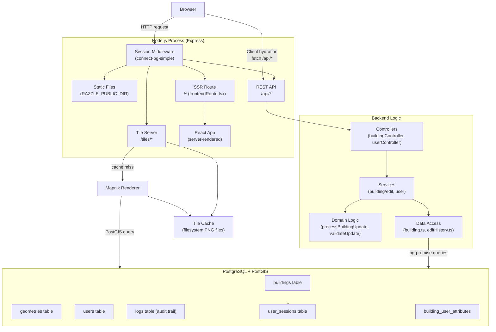

# Colouring Ghana — Developer Onboarding Guide

## 1. What Does the Product Do?

**Colouring Ghana** is a citizen science web application where members of the public collaboratively map and record attributes of buildings across Ghana. Think of it as Wikipedia, but for buildings.

Users navigate a map, click on a building, and fill in details across 12 categories:

- Location & use (address, land use type)
- Age & history (construction date, demolished buildings)
- Size & shape (floors, storeys)
- Construction materials and typology
- Building condition
- Streetscape
- Team (who built/designed it)
- Planning & protection status
- Sustainability / energy use (BREEAM ratings)
- Dynamics (change over time)

Every edit is attributed to the user who made it and a full audit trail is kept. A live map renders buildings colour-coded by their attributes. The data is ultimately intended to support urban planning, conservation decisions, and policy in Ghana. The platform is run in partnership with KNUST (Kwame Nkrumah University of Science and Technology).

---

## 2. Technology Stack

| Layer | Technology | Version | Role |
|---|---|---|---|
| Language | TypeScript | 4.2 | All code (frontend + backend) |
| Runtime | Node.js | 12+ | Server runtime |
| Web framework | Express | 4.21 | HTTP server, routing, sessions |
| UI framework | React | 17 | Component-based frontend |
| SSR framework | Razzle | 4.0 | Isomorphic/SSR build tooling on top of Webpack |
| Routing (client) | React Router | 5.2 | SPA page routing |
| Map (client) | Leaflet + React-Leaflet | 1.7 / 3.1 | Interactive map display |
| Map (server) | Mapnik | 4.5 | Renders PNG map tiles from PostGIS data |
| CSS | Bootstrap | 5.0 | Layout and base styling |
| Database | PostgreSQL + PostGIS | — | Relational DB + spatial extensions |
| DB client | pg-promise | 10.11 | Query execution and transactions |
| Sessions | connect-pg-simple | 6.1 | Stores sessions in PostgreSQL |
| Validation | AJV + ajv-formats | 7.1 | JSON Schema validation of building edits |
| Image processing | Sharp | 0.32 | Tile image manipulation |
| Email | Nodemailer | 6.4 | Sends password-reset emails |
| Utilities | Lodash | 4.17 | General helpers |
| Testing | Jest + ts-jest | — | Unit tests |
| Linting | ESLint | 7.24 | Code quality checks |
| Process manager | PM2 | — | Production process management |
| CI | Travis CI | — | Automated test runs |

---

## 3. System Architecture

This is a **monolith** — one Node.js process handles SSR, the REST API, and tile serving. There are no microservices, no message queues, no separate frontend deployment.



**Key architectural point:** The frontend is *isomorphic* — React components render on the server first (SSR), then the client picks up the same state and re-hydrates. This is what Razzle manages. API calls from the browser after page load are plain `fetch` calls to `/api/*`.

---

## 4. File Organization and Conventions

```
app/src/
├── api/
│   ├── controllers/         ← Thin request handlers: validate input, call service, send response
│   ├── routes/              ← Express route definitions (which URL maps to which controller)
│   ├── services/
│   │   ├── building/        ← Building-specific business logic (edit, query, verify, history)
│   │   ├── domainLogic/     ← Complex rules (land use processing, update validation, aggregation)
│   │   └── __tests__/       ← Service-layer unit tests
│   ├── dataAccess/          ← All SQL queries live here — nothing else touches the DB directly
│   │   └── __mocks__/       ← Jest manual mocks for dataAccess modules
│   ├── models/              ← TypeScript interfaces (Building, BuildingAttributes, etc.)
│   ├── config/
│   │   ├── dataFields.ts    ← Master list of all building attributes (editable, verifiable, derived)
│   │   ├── fieldSchemaConfig.ts ← AJV validation schemas per field
│   │   └── aggregationsConfig.ts
│   └── errors/              ← Custom error classes (ApiUserError, UserError, DatabaseError, etc.)
├── frontend/
│   ├── app.tsx              ← Root React component and route definitions
│   ├── building/
│   │   ├── data-container.tsx   ← HOC that wraps every building data category with edit/save logic
│   │   ├── data-containers/     ← One file per data category (location, age, construction, etc.)
│   │   └── data-components/     ← Reusable input components (text, number, multi-select, year, etc.)
│   ├── pages/               ← Static pages (about, contact, data accuracy, etc.)
│   ├── user/                ← Login, register, password reset, account pages
│   ├── components/          ← Shared UI (buttons, collapsible sections, etc.)
│   ├── api-data/            ← Custom hooks that fetch/post to the API (use-building-data.ts, etc.)
│   ├── config/              ← Frontend field config (mirrors api/config but for display)
│   └── models/              ← Frontend TypeScript types
├── tiles/
│   └── tileserver.ts        ← Mapnik tile rendering logic
├── server.tsx               ← Express app setup (sessions, routes, middleware)
├── client.tsx               ← Browser entry point (hydrates SSR React)
├── frontendRoute.tsx        ← SSR handler (pre-fetches building data, renders React to string)
├── db.ts                    ← Singleton pg-promise database connection
└── cc-config.json           ← Ghana-specific config (map centre, zoom, institution name)
```

**Naming conventions:**
- Controllers: `{resource}Controller.ts`
- Services and data access: lowercase (`edit.ts`, `query.ts`, `building.ts`)
- React components: PascalCase files and function names
- Tests: co-located in `__tests__/` folders, named `{module}.test.ts`
- URL parameters: snake_case (`:building_id`)

**Layering rule:** Data only flows downward: `controller → service → domainLogic → dataAccess → DB`. Never the other way around. No direct DB queries in controllers or frontend.

---

## 5. Core Database Entities

```mermaid
erDiagram
    geometries {
        serial geometry_id PK
        varchar source_id
        geometry geometry_geom "PostGIS polygon EPSG:3857"
    }

    buildings {
        serial building_id PK
        varchar ref_toid "OS MasterMap ID"
        bigint ref_osm_id "OpenStreetMap ID"
        int geometry_id FK
        bigint revision_id FK "latest log entry"
        varchar location_name
        varchar date_year
        varchar construction_material
        "50+ attribute columns" _ "added by later migrations"
    }

    building_properties {
        serial building_property_id PK
        bigint uprn "Unique Property Reference"
        bigint parent_uprn
        int building_id FK
        varchar toid
        geometry uprn_geom "PostGIS point"
    }

    building_user_attributes {
        int building_id FK
        uuid user_id FK
        jsonb attributes "per-user attribute values"
    }

    users {
        uuid user_id PK
        varchar username "4-30 chars, unique"
        varchar email "unique"
        varchar pass "bcrypt hash via pgcrypto"
        timestamp registered
        int category FK
        int access_level FK
        uuid api_key "nullable, for API access"
        bool is_deleted
    }

    user_sessions {
        varchar sid PK
        json sess "session payload"
        timestamp expire
    }

    logs {
        bigserial log_id PK
        timestamp log_timestamp
        jsonb forward_patch "what changed"
        jsonb reverse_patch "previous values"
        uuid user_id FK
        int building_id FK
    }

    user_access_levels {
        serial access_level_id PK
        varchar access_level_name "e.g. untrusted, regular, admin"
    }

    user_categories {
        serial user_category_id PK
        varchar category_name "user self-described role"
    }

    buildings ||--|| geometries : "has footprint"
    buildings ||--o{ building_properties : "has UPRNs"
    buildings ||--o{ logs : "edit history"
    buildings ||--o{ building_user_attributes : "per-user data"
    users ||--o{ logs : "made edits"
    users ||--o{ building_user_attributes : "contributed data"
    users }o--|| user_access_levels : "has level"
    users }o--|| user_categories : "has category"
    logs ||--o| buildings : "revision_id points back"
```

**Key design decisions:**
- `buildings` stores the *current* consensus state. Every historical state is in `logs` as JSON patches.
- `building_user_attributes` stores what each individual user believes — separate from the main `buildings` table. An aggregation step computes a consensus value from all users' inputs and writes it to `buildings`.
- `geometry_geom` uses Web Mercator (EPSG:3857), not WGS84 lat/lng, because Mapnik expects it.
- Passwords are hashed with bcrypt *inside PostgreSQL* using pgcrypto's `crypt()` function — not in Node.js.

---

## 6. Full Request Lifecycle: User Edits a Building

Scenario: a logged-in user changes the `construction_material` field on a building and clicks Save.

```
┌─────────────────────────────────────────────────────────────┐
│  BROWSER                                                    │
│                                                             │
│  1. User edits field in <DataContainer> component           │
│     app/src/frontend/building/data-container.tsx            │
│     → local React state updated via handleChange()          │
│                                                             │
│  2. User clicks Save → handleSubmit() fires                 │
│     → calls sendBuildingUpdate(buildingId, editedFields)    │
│       app/src/frontend/api-data/building-update.ts          │
│     → POST /api/buildings/12345.json                        │
│       body: { attributes: { construction_material: "brick"},│
│               user_attributes: {} }                         │
└──────────────────────┬──────────────────────────────────────┘
                       │ HTTP POST
┌──────────────────────▼──────────────────────────────────────┐
│  EXPRESS (server.tsx)                                       │
│                                                             │
│  3. Session middleware checks cookie 'cl.session'           │
│     → req.session.user_id = "uuid-of-user"                  │
│                                                             │
│  4. Routed to buildingsRouter.ts                            │
│     app/src/api/routes/buildingsRouter.ts                   │
│     router.route('/:building_id.json').post(controller)     │
│                                                             │
│  5. asyncController wrapper catches any thrown errors       │
│     and passes them to next() (global error handler)        │
└──────────────────────┬──────────────────────────────────────┘
                       │
┌──────────────────────▼──────────────────────────────────────┐
│  CONTROLLER                                                 │
│  app/src/api/controllers/buildingController.ts              │
│                                                             │
│  6. Auth check: user_id from session OR api_key query param │
│     → if neither: return { error: 'Must be logged in' }     │
│                                                             │
│  7. Parse: buildingId, attributes, user_attributes from req │
│                                                             │
│  8. Call: buildingService.editBuilding(id, userId, data)    │
└──────────────────────┬──────────────────────────────────────┘
                       │
┌──────────────────────▼──────────────────────────────────────┐
│  SERVICE LAYER                                              │
│  app/src/api/services/building/edit.ts                      │
│                                                             │
│  9. Validate: validateChangeSet(attributes)                 │
│     → AJV schema check against fieldSchemaConfig.ts         │
│     → throws InvalidFieldError if type/format wrong         │
│                                                             │
│ 10. Open SERIALIZABLE database transaction                  │
│     app/src/api/dataAccess/transaction.ts                   │
│     (prevents two concurrent edits corrupting data)         │
│                                                             │
│ 11. Domain logic: processBuildingUpdate()                   │
│     app/src/api/services/domainLogic/processBuildingUpdate  │
│     → derives land_use_order from land use category         │
│     → validates demolished_buildings sub-objects            │
│                                                             │
│ 12. Save user's personal view:                              │
│     updateBuildingUserData(buildingId, userId, userAttrs)   │
│                                                             │
│ 13. Aggregate all users' values into consensus:             │
│     aggregateUserAttributes()                               │
│     → median/mode computation per field                     │
│                                                             │
│ 14. Compute diff: forward_patch (new values)                │
│                   reverse_patch (old values for undo)       │
│                                                             │
│ 15. Insert audit record: insertEditHistoryRevision()        │
│     → INSERT INTO logs (forward_patch, reverse_patch, ...)  │
│     → returns new log_id                                    │
│                                                             │
│ 16. Update building: updateBuildingData()                   │
│     app/src/api/dataAccess/building.ts                      │
│     → UPDATE buildings SET construction_material=$1,        │
│         revision_id=$2 WHERE building_id=$3                 │
│     → RETURNING updated columns                             │
│                                                             │
│ 17. Commit transaction                                      │
│                                                             │
│ 18. Invalidate tile cache: expireBuildingTileCache()        │
│     → deletes cached PNG files for this building's tiles    │
│     → next map request will re-render fresh tiles           │
└──────────────────────┬──────────────────────────────────────┘
                       │
┌──────────────────────▼──────────────────────────────────────┐
│  CONTROLLER (returns to)                                    │
│                                                             │
│ 19. res.send({                                              │
│       attributes: { ...updated building fields },           │
│       user_attributes: { ...user's personal data },         │
│       revision_id: "12345678"                               │
│     })                                                      │
└──────────────────────┬──────────────────────────────────────┘
                       │ HTTP 200 JSON
┌──────────────────────▼──────────────────────────────────────┐
│  BROWSER                                                    │
│                                                             │
│ 20. sendBuildingUpdate() resolves with the response         │
│     → DataContainer updates local React state               │
│     → UI re-renders with confirmed saved values             │
│     → Map tiles eventually reload showing new colour        │
└─────────────────────────────────────────────────────────────┘
```

**If anything goes wrong** along the way:
- Validation error (step 9) → `InvalidFieldError` → caught by controller → re-thrown as `ApiUserError` → global error handler → HTTP 400 `{ error: "..." }`
- DB error (steps 15–16) → `DatabaseError` → global handler → HTTP 500 `{ error: "Database error" }`
- Auth failure (step 6) → HTTP 200 `{ error: "Must be logged in" }` — note this returns 200, not 401; a known quirk

---

## 7. Testing

**Framework:** Jest with ts-jest (TypeScript support). Tests run with `--env=jsdom` so both Node and browser globals are available.

**Test files:**
- `app/src/api/services/__tests__/editHistory.test.ts` — edit history service
- `app/src/api/services/__tests__/domainLogic/landUse.test.ts` — land use category logic
- `app/src/frontend/app.test.tsx` — smoke test for the React app

**Pattern used:**

```typescript
// Mock the data access layer so tests don't need a real database
jest.mock('../../dataAccess/editHistory');

describe('getGlobalEditHistory', () => {
    beforeEach(() => {
        mockedEditHistoryData.getEditHistoryFromDB.mockResolvedValue([...]);
    });

    it('should return latest history if no ID specified', async () => {
        const result = await getGlobalEditHistory(null, null, 5);
        expect(result.history.map(x => x.revision_id)).toEqual(['119','118','117','116','115']);
    });
});
```

**What's tested:** Service layer logic (edit history, land use derivation). The database layer is **mocked** — tests never hit a real database.

**What's not well tested:** Controllers, the full edit flow end-to-end, most frontend components.

**Run a single test file:**
```bash
npm test -- --testPathPattern=editHistory
```

---

## 8. How the Team Works

**Branching strategy** (from `CONTRIBUTING.md`):

| Branch type | Naming pattern | Example |
|---|---|---|
| Feature | `feature/short-desc` or `feature/issue-number-desc` | `feature/geolocation-control` |
| Fix | `fix/issue-number-short-desc` | `fix/681-land-use-edit` |
| Main | `master` | always deployable |

Active branches: `feature/geolocation-control`, `feature/vector-tile-rendering`, `cerc-deployment`, `render-test-deployment`.

**Commit message convention:** Start with an uppercase letter. Example: `Update building conditions` not `update building conditions` or `fixed stuff`.

**Recent commit activity:**
```
afd9558  Update building conditions       ← domain logic / attribute changes
eb05a80  Remove unnecessary files
96dc613  Updated .gitignore
a362351  Remove app/app/tilecache         ← infrastructure cleanup
2978379  included knust logo on welcome page ← UI/branding
```

The codebase is in active customization for Ghana — recent work has been on branding and building condition attributes.

**"Generifying" rule:** Never hardcode city names or Ghana/KNUST-specific text in logic. Use `cc-config.json` values for anything city-specific, so the platform can be re-deployed for other cities.

---

## 9. Getting It Running Locally

**Prerequisites:** Node.js 12+, PostgreSQL with PostGIS, npm.

**Step 1 — Clone and install:**
```bash
git clone <repo-url>
cd colouring-ghana/app
npm install
```

**Step 2 — Set up the database:**
```bash
psql -U postgres -c "CREATE DATABASE colouringghana;"
psql -U postgres -d colouringghana -c "CREATE EXTENSION postgis;"
psql -U postgres -d colouringghana -c "CREATE EXTENSION pgcrypto;"
psql -U postgres -d colouringghana -c "CREATE EXTENSION pg_trgm;"

# Run migrations in numeric order from repo root
psql -U postgres -d colouringghana < migrations/001.core.up.sql
psql -U postgres -d colouringghana < migrations/002.index-geometries.up.sql
# ... continue through all migration files in order
```

**Step 3 — Set environment variables:**

Copy `ecosystem.config.dev-template.js` to `ecosystem.config.dev.js` and fill in values, or export directly:

```bash
export PGHOST=localhost
export PGPORT=5432
export PGDATABASE=colouringghana
export PGUSER=postgres
export PGPASSWORD=yourpassword
export APP_COOKIE_SECRET=any-long-random-string-here
export TILECACHE_PATH=/tmp/colouring-ghana-tiles
export WEBAPP_ORIGIN=http://localhost:3000
export PORT=3000
# Optional — only needed for password reset emails
export MAIL_SERVER_HOST=smtp.example.com
export MAIL_SERVER_PORT=587
export MAIL_SERVER_USER=user
export MAIL_SERVER_PASSWORD=password
```

**Step 4 — Create tile cache directory:**
```bash
mkdir -p /tmp/colouring-ghana-tiles
```

**Step 5 — Start the dev server:**
```bash
cd app
npm start
```

Open `http://localhost:3000`. The map loads but will be empty until building geometry data is loaded (see `etl/` scripts for loading OSM or OS MasterMap building footprints).

**Step 6 — Run tests:**
```bash
npm test
```

> **Note on Vagrant:** The repo includes a `Vagrantfile` that provisions a full Ubuntu 18.04 VM. Run `vagrant up` if you prefer an isolated environment, but the manual steps above are simpler if you already have Postgres and Node installed.

---

## 10. Authentication and Authorization

**How identity is established — two methods:**

**1. Session cookie (browser flow):**
- `POST /api/login` with `{ username, password }`
- Server runs bcrypt comparison *inside PostgreSQL*:
  `SELECT pass = crypt($password, pass) AS auth_ok FROM users WHERE username = $1`
- On success: `req.session.user_id = uuid` stored in the `user_sessions` table
- Cookie `cl.session` is set in the browser (30-day max age; `secure: true` in production)

**2. API key (programmatic access):**
- `POST /api/api/key` (requires an existing session) generates a UUID stored on the user record
- Pass as query param: `GET /api/buildings/123.json?api_key=your-uuid`

**How permissions are enforced:**

Currently simple — either you have a valid session/API key or you don't. The pattern used in every controller:

```typescript
const userId = req.session.user_id ?? (
    req.query.api_key
        ? await userService.authAPIUser(String(req.query.api_key))
        : undefined
);
if (!userId) {
    return res.send({ error: 'Must be logged in' });
}
```

A `user_access_levels` table exists (`untrusted`, `regular`, `admin`) but fine-grained permission checks based on access level are not yet widely enforced — most protection is currently just "logged in vs. not logged in".

**Password reset:** Users request a reset link by email via Nodemailer. Tokens are stored in the database. Known issue: old tokens for the same user are not invalidated when a new one is issued (see tech debt section).

---

## 11. CI/CD Pipeline

**CI: Travis CI** (`.travis.yml`):
```yaml
language: node_js
node_js:
  - 12
cache: npm
before_script:
  - cd app && npm ci
script:
  - npm test
```

Every push and PR runs `npm test`. There is no build step, no linting step, and no deployment step in CI.

**Deployment is fully manual:**
1. `cd app && npm run build`
2. Copy build output to server
3. Configure PM2 using `ecosystem.config.template.js`
4. `NODE_ENV=production pm2 start ecosystem.config.js`

Code reaching `master` does not automatically deploy anywhere.

---

## 12. Error Handling and Logging

**Error class hierarchy** (`app/src/api/errors/`):

```
ApiUserError         → HTTP 400, message safe to show users
  ├── ApiParamError
  ├── ApiParamRequiredError
  └── ApiParamInvalidFormatError

UserError            → domain errors, converted to ApiUserError at controller layer
  ├── ArgumentError
  ├── InvalidOperationError
  ├── InvalidFieldError
  └── FieldTypeError

DatabaseError        → HTTP 500, internal detail hidden from users
```

**Error flow:**
1. Domain code throws `UserError` or `InvalidFieldError`
2. Controller catches it and re-throws as `ApiUserError` (preserving the message)
3. `asyncController` wrapper passes unhandled rejections to `next(err)`
4. Global handler in `api.ts` sends the response:
   - `ApiUserError` → HTTP 400 `{ error: "Problem with parameter X: message" }`
   - `DatabaseError` → HTTP 500 `{ error: "Database error" }`
   - Anything else → HTTP 500 `{ error: "Server error" }`

**Logging:** No structured logging library — everything uses `console.log` and `console.error` directly. In production, view logs via PM2:

```bash
pm2 logs
```

**When something breaks:** Check PM2 logs first, find the error, then trace back through the controller → service → dataAccess layer using the file paths in section 4.

---

## 13. Known Tech Debt and Rough Areas

**TypeScript `any` types (being actively cleaned up):**
All have `// TODO: remove any` comments:
- `server.tsx` — session object typed as `any`
- `client.tsx` — `__PRELOADED_STATE__` typed as `any`
- `frontendRoute.tsx` — SSR context and data typed as `any`

Safe to ignore for now, but be careful extending these files.

**Missing error UI:**
`use-building-data.ts`, `use-user-verified-data.ts`, and `use-building-like-data.ts` all have `// TODO: add UI for API errors`. API failures in these hooks currently fail silently from the user's perspective.

**Incomplete input components:**
- `year-data-entry.tsx` — decade/century support not implemented
- `multi-select-data-entry.tsx` — multi-select not yet available on all field types
- `typology-size.tsx` — placeholder values, not production data

**Infrastructure:**
- `tileCache.ts` — uses older callback-based `fs` API; TODO to switch to promise-based
- `dataExtract.ts` — base path for data exports is hardcoded; should come from env var

**Auth:**
- `passwordReset.ts` — old reset tokens for a user are never invalidated when a new one is issued
- Auth failures return HTTP 200 with `{ error: "..." }` instead of HTTP 401 — be aware of this when debugging or writing API clients

**Hottest files** — most likely to change as the Ghana customization continues:
- `app/src/frontend/building/data-containers/` — one file per building category
- `app/src/api/config/dataFields.ts` — master attribute definitions
- `migrations/` — any new attribute needs a new migration file
